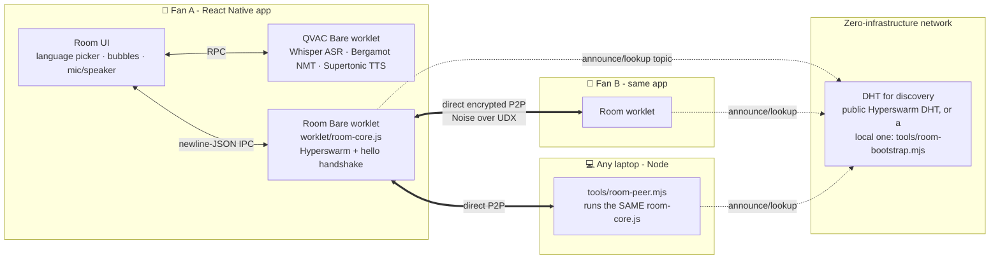
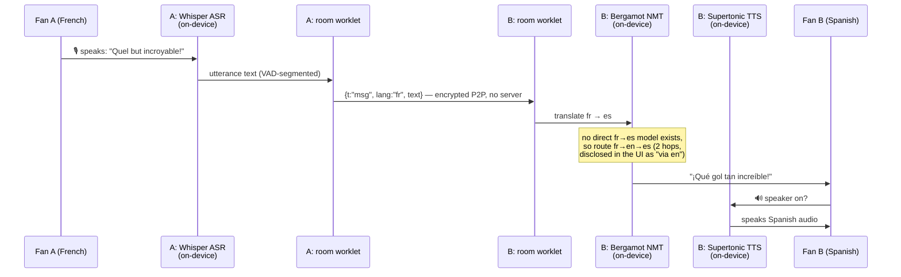
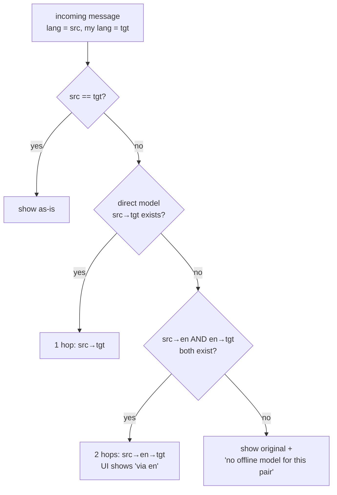

# TIFO — the multilingual P2P fan room ⚽

**Fans at the same match don't speak the same language. TIFO lets them talk anyway — with no server, no cloud, no account, and no internet once it's warmed up.**

Every fan writes (or **speaks**) in their own language. Every other fan reads — and can **hear** — it in theirs. The AI runs entirely on each phone (**QVAC**), and the messages travel entirely peer-to-peer (**Pears / Hyperswarm**). Kill the internet and the room keeps working.

> **Tracks: QVAC (Local AI) + Pears (P2P)** — both load-bearing: remove either and the product stops existing.
>
> 🎬 **Demo video:** *(unlisted YouTube link goes here at submission)*

<!-- SCREENSHOTS: re-enable this table once docs/img/*.png are captured from the phone
     (adb exec-out screencap; shots to take: Home, the fr→es·via-en room bubble, 🎙 listening state)

| | | |
|---|---|---|
|  |  |  |
| Honest trust badge: 0 servers | English + French peers, read in Spanish — `fr → es · via en · on-device` | 🎙 Speak → on-device Whisper → posted to the room |

*(Screenshots are unedited captures from the demo phone — a 4 GB OPPO CPH2591, Android 15.)*
-->

*All claims below were exercised on real hardware — a 4 GB OPPO CPH2591 (Android 15) talking to Node peers on a laptop over a fully local DHT.*

---

## Why this can't be "just another AI app"

A thousand hackathon apps call a cloud translation API. TIFO is the app for the moment the cloud is *gone* — and that moment is **this tournament**:

- **World Cup 2026 is being called ["the biggest network stress test of 2026"](https://capacityglobal.com/news/world-cup-stress-test/)** — 50+ TB of data per match, carriers 3–5×-ing stadium bandwidth and still choking at kickoff and goals, exactly when fans want to talk.
- **It's the most multilingual crowd ever assembled** — [48 teams, 30+ languages, 6M+ visitors](https://breakingthelines.com/opinion/2026-world-cup-48-teams-dozens-of-languages-one-tournament/), with fan conversation "locked behind language walls."
- **Anywhere private**: messages go phone-to-phone, encrypted by Hyperswarm's Noise transport. No server ever sees them — there is no server to fail, subpoena, or [investigate](https://www.npr.org/2026/06/26/nx-s1-5871397/world-cup-tickets-stubhub-resale-controversy).

The two Tether stacks aren't decoration here — they're the *only* way to build this:

| Requirement | Why cloud fails | What we use |
|---|---|---|
| Translation with no connectivity | API needs internet | **QVAC** Bergamot NMT on-device (~30 MB/pair) |
| Speech in/out with no connectivity | Cloud ASR/TTS needs internet | **QVAC** Whisper + Supertonic on-device |
| Messaging with no infrastructure | Servers, accounts, uptime | **Pears** Hyperswarm — peers find each other on a DHT and connect directly |

## Architecture

Two [Bare](https://github.com/holepunchto/bare) worklets run inside the React Native app — one is QVAC's AI engine, the other is **our** P2P room. The laptop peer runs the *identical* room code on Node: same code, any device.



**What one message goes through — all of it on-device:**



**Translation routing** (the SDK ships 101 Bergamot pairs — every one involves English, so English is the hub; we verified this against the installed SDK rather than assuming it):



## For the judges — the five criteria, honestly

**Technical ambition.** Two Bare worklets in one RN app (QVAC's AI engine + our own Hyperswarm room, bundled with `bare-pack --linked`); on-device ASR→NMT→TTS chained across languages with hub-pivot routing; a local 6-node DHT testnet tool so the whole thing runs with zero internet. Real bugs found and fixed along the way are documented below — including one in how the QVAC SDK returns TTS audio on React Native.

**User experience.** Pick your language, that's the entire onboarding. Messages show the translation first with the original underneath, the route disclosed (`en → hi · on-device`, `via en`), honest intermediate states (`translating…`), honest failures (`no offline model for this pair — original shown`). RTL works (Arabic). Scripts Archivo can't render fall back per-glyph (Devanagari chips render correctly). Speaker and mic are one tap each.

**Real-world use.** Match-day connectivity collapse is a real, recurring problem; so are language-mixed fan crowds (World Cup, Champions League away legs). Everything demonstrated works on a **4 GB budget phone**, and the whole trilingual AI footprint was **75 MB of models** (+121 MB if you enable the voice).

**Creativity.** The room *is* the translator. There's no "translation feature" bolted onto chat — each phone renders the same room in its owner's language, and voice rides the identical path as text (speech becomes a message; messages become speech).

**Real use of the tracks.** QVAC: every AI inference (ASR, NMT×101 pairs, TTS, VAD) runs through `@qvac/sdk` on the device — no cloud AI anywhere. Pears: every byte of messaging moves over Hyperswarm (hyperdht discovery, Noise-encrypted UDX connections) — no WebRTC, no fallback server. Delete either stack and there is no product.

<details>
<summary><b>Pears Stack compliance in detail</b></summary>

All networking is Holepunch building blocks: `hyperswarm` (peer discovery + connections), `hyperdht` (DHT, incl. our local testnet), Noise-encrypted `udx` transport, `b4a`/`sodium-universal` underneath. The runtime the room runs in is **Bare — Holepunch's own JavaScript runtime** ([bare.pears.com](https://bare.pears.com/)), embedded via Holepunch's first-party [`react-native-bare-kit`](https://github.com/holepunchto/react-native-bare-kit) and bundled with `bare-pack`. This is the **same architecture as Keet Mobile**, Holepunch's flagship app (React Native UI + Bare worklet doing 100% of the P2P work). Pears itself is [evolving `pear run` into an embeddable runtime library with `pear-mobile` on the way](https://pears.com/news/pear-evolution/) — an embedded-Bare mobile app is where the platform is heading. No WebRTC, no relay servers, no cloud fallback anywhere in the tree.
</details>

## Run it in 60 seconds (no phone needed)

Judges can see the P2P room work on any machine with Node ≥ 20:

```bash
git clone <this repo> && cd tifo-app
npm install

# terminal 1 — a local DHT (6-node testnet, hyperdht's own pattern)
node tools/room-bootstrap.mjs --port 49737 --host 127.0.0.1

# terminal 2 — a fan
node tools/room-peer.mjs --name Ana --lang es --bootstrap 127.0.0.1:49737

# terminal 3 — another fan
node tools/room-peer.mjs --name Bob --lang en --bootstrap 127.0.0.1:49737
# type in either terminal → the message appears in the other, with name + language
```

That's the identical `worklet/room-core.js` the phones run. (The Node peers display originals; the on-device translation/speech is the phone app + the video.)

### The full app on a phone

```bash
npm install
npx expo prebuild --platform android   # generates native projects + QVAC worker bundle
npx expo run:android                   # physical device required — QVAC doesn't run on emulators
npm run bundle:room                    # only needed after editing worklet/*.js
```

Point `assets/config.json → room.bootstrap` at your machine's `<LAN-IP>:49737` for the zero-internet LAN demo (empty array = public Hyperswarm DHT — note that two devices behind the *same* router need the local DHT, because NAT hairpinning silently defeats the public one). Full demo choreography, pre-warm steps and troubleshooting: **[DEMO.md](DEMO.md)**.

## What's measured, not promised

| Fact | Value |
|---|---|
| Peer joins an established room | **0.1–0.4 s** (laptop), ~4.5 s (phone, fresh app) |
| Two peers joining *simultaneously* | 4.1 s (our re-query loop; stock Hyperswarm would take 10–12 min — see below) |
| Bergamot translation model | ~30 MB per direction, lazy-downloaded, cached |
| Whole trilingual text session | **75 MB** on-device cache |
| Multilingual TTS voice | 121 MB (optional, one-time) |
| Whisper-tiny ASR + Silero VAD | ~75 MB (optional, one-time) |
| Demo hardware | OPPO CPH2591, 4 GB RAM, Android 15 |
| Native addons the room needs | udx-native, sodium-native, bare-inspect, bare-type — all already shipped by QVAC's addon manifest |

## Engineering notes (the bugs we earned)

These cost real debugging time and are exactly the kind of thing you only learn by building on the actual stacks:

1. **Hyperswarm re-queries a topic every 10–12 minutes** (`REFRESH_INTERVAL` + jitter). Two fans opening the room at the same moment would miss each other for minutes. Our room re-queries every 4 s *while alone*, then stands down (`worklet/room-core.js`).
2. **A single local DHT bootstrap node cannot work.** hyperdht announces need a storage quorum; with one node they fail with `Too few nodes responded` — which hyperswarm safety-catches, so it looks like "announced" and silently finds nobody. `tools/room-bootstrap.mjs` therefore runs a small testnet (hyperdht's own pattern).
3. **Same-NAT peers silently never connect on the public DHT** (hairpinning). The local DHT sidesteps it — and doubles as the airplane-mode demo architecture.
4. **QVAC `textToSpeech` returns `buffer` as a plain `number[]` on React Native** (JSON RPC wire — typed arrays don't survive). Code expecting `Int16Array` silently produces *empty audio*. Fixed with a normalizing converter (`src/audio/pcm.ts → toInt16Pcm`).
5. **QVAC `unloadModel` does not promptly free native RAM.** Our original grounded-Q&A companion (embedding RAG + 1B LLM) worked, but co-residency OOM'd the 4 GB phone — "load models sequentially" can't rescue you if unload doesn't free. We cut the feature and rebuilt the product around light models. That failed branch is preserved in git history; the working Node/web version lives in the sibling `qvac-spike` repo.

## Honest limitations

- **No message history for late joiners** — the room is a live swarm, not a log. (Roadmap: Hypercore/Autobase-backed history — the stack is already in the dependency tree.)
- **Whisper-tiny is fragile in noisy rooms.** Clear, close speech works; stadium ambience needs a bigger model or a push-to-talk UX.
- **Bergamot is literal** ("what a comeback" → "qué regreso"). It's also 30 MB and runs on a 4 GB phone, which is the point.
- **First-ever DHT discovery on a fresh app start can take up to ~1 min**; joins after that are seconds. Pre-warm before demos.
- Language list is config (`assets/config.json`), filtered at runtime to what the shipped NMT models can actually reach — adding a language is a config edit, not code.

## Outside services & pre-built parts (full disclosure)

- **`@qvac/sdk`** — on-device AI runtime + model registry (models download from Tether's registry on first use; that is the *only* non-P2P network traffic, and it's one-time).
- **Pears stack:** `hyperswarm`, `hyperdht`, `b4a`, `sodium-universal` (+ `hypercore`/`hyperbee`/`corestore` in-tree for the history roadmap).
- **`react-native-bare-kit`** (Holepunch) — runs the Bare worklets; `bare-pack` bundles ours.
- **Expo SDK 54 / React Native 0.81**, `expo-audio` (playback + mic permission), `expo-stream-audio` (raw PCM mic frames), `expo-file-system`, `expo-device`, `expo-font` + Archivo/JetBrains Mono fonts.
- No cloud APIs, no API keys, no analytics, no server of ours — there isn't one.

## Repo tour

```
worklet/room-core.js     the P2P room (runs unchanged on Bare AND Node — this is the demo trick)
worklet/room.js          Bare worklet entry: BareKit IPC bridge
src/mesh/room.ts         RN side: starts the worklet, speaks newline-JSON
src/qvac/roomTranslate.ts hub-pivot routing + lazy per-pair model cache
src/qvac/roomVoice.ts    TTS speak-queue (serial, never overlaps)
src/qvac/roomMic.ts      mic → Whisper+VAD → utterances → room
src/qvac/liveTranslate.ts the original live commentary translation pipeline
src/screens/             Home / Room / Live — the whole UI
tools/room-bootstrap.mjs local 6-node DHT (zero-internet demos)
tools/room-peer.mjs      laptop fan (same room-core)
DEMO.md                  demo runbook · PORTING.md engineering log
```

## License

[MIT](LICENSE). Built solo during the Tether Developers Cup; the repo's commit history is the build log.
